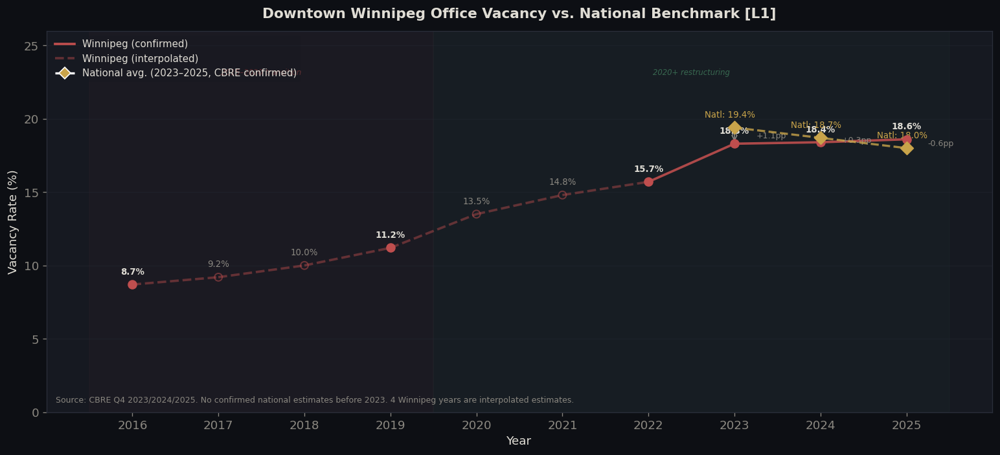
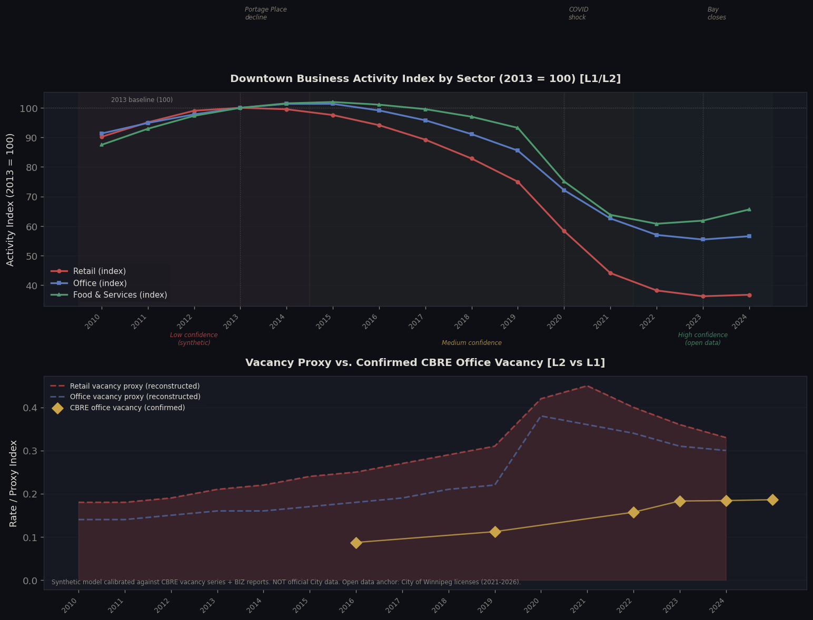
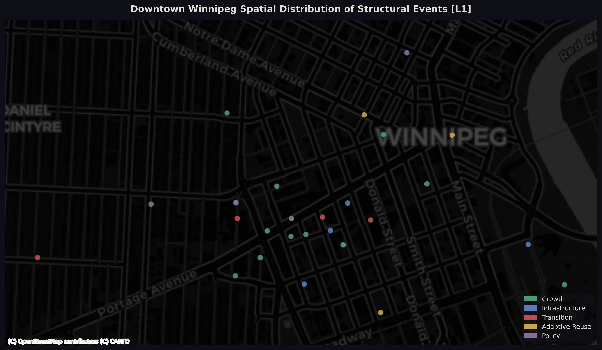
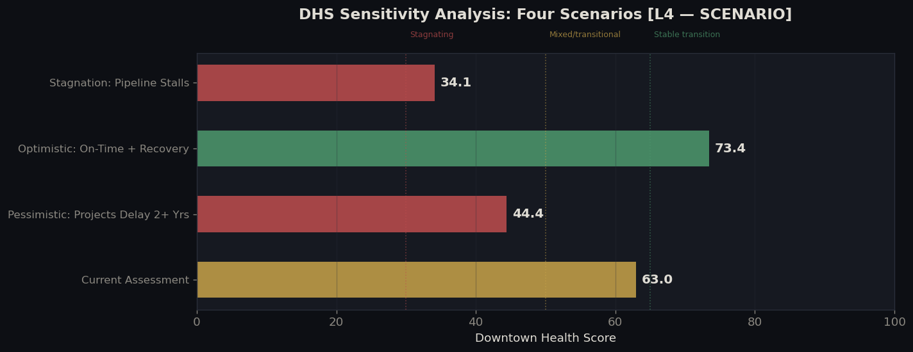

# Reimagining Downtown Winnipeg: A $2.3B Transition From Retail to Residential (2010–2026)

**Troy Dela Rosa**

**Downtown Winnipeg isn't dying. It's being rebuilt into something different - and the results won't show up until 2027 or 2028.**

Over $2.3 billion is actively under construction. More than 1,600 new apartments are confirmed. Office vacancy has doubled. Retail is down 63% from its 2013 peak. These aren't contradictory signals - they're the same story at different points in time. The cranes are real. The empty storefronts are real. The question is whether the renovation gets finished.

**In short:** Downtown Winnipeg is in the messy middle of a multi-billion dollar transformation that may not be fully visible on the street for another two years.

## The Numbers

| | |
|---|---|
| Active investment | ~$2.3 billion |
| New apartments confirmed | 1,635-1,793 units |
| Office space sitting empty | 18.6% (doubled since 2016) |
| Retail activity vs. 2013 | Down ~63% |
| Downtown health score | 63 / 100 - mixed, not failing |

## Office Vacancy Has Nearly Doubled - But Slowing Down

Vacancy rose from 8.7% in 2016 to 18.6% in 2025. The good news: the pace dropped sharply in 2024-2025, rising just 0.3 points across both years. The worst of the increase appears to be behind us.

## Restaurants Are Recovering. Retail Is Not.

Retail is down 63% from its 2013 peak - which explains most of the empty storefronts. But restaurants and cafes have bounced back more than any other sector since COVID. If you've noticed more good places to eat downtown lately, the data backs that up.

## The Construction Is Concentrated in Six City Blocks

Almost everything is happening along Portage Avenue between the old Bay building and True North Square. Walk east into the Exchange District and the picture looks very different. Downtown isn't one place right now - it's two.

## It All Depends on Whether the Buildings Get Finished

If projects finish on time and people move in, the downtown health score could reach **73 out of 100**. If construction delays by two or more years, it drops to **44**. The empty storefronts won't fill back up until the 1,600+ new residents arrive - and that won't happen before 2027.

This analysis builds on a growing local conversation about downtown Winnipeg’s future. Recent reporting has increasingly framed major projects like Portage Place and the former Bay building not as a return to the old retail model, but as part of a broader shift toward housing, institutional uses, and adaptive reuse. This project adds a data-based framework for connecting those redevelopment stories to vacancy trends, business activity, spatial concentration, and delivery timing.

## About the Data

Vacancy figures from CBRE market reports (4 of 10 years are estimates). Business activity before 2021 reconstructed from other sources - directional trends only. Investment amounts from press releases. Full source registry: [`data/downtown_wpg_sources_2026.csv`](data/downtown_wpg_sources_2026.csv)

**To run:** Open `notebooks/stakeholder_report.ipynb` - requires `pandas numpy matplotlib seaborn scikit-learn openpyxl`

*April 2026*
