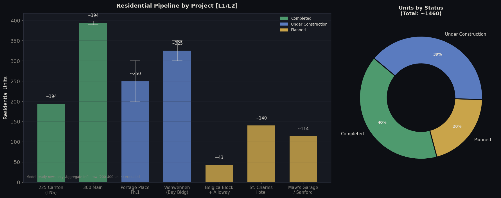

<!-- Banner image -->
# Reimagining Downtown Winnipeg: A $2.3B Transition From Retail to Residential (2010-2026)

**Troy Dela Rosa**


## What Is Happening Downtown?

If you've walked through Downtown Winnipeg lately, you've probably noticed something that feels contradictory. There are cranes in the sky and construction fences everywhere - but there are also empty storefronts, closed malls, and quieter streets than you remember from ten or fifteen years ago.

So which is it? Is downtown dying, or is it being rebuilt?

This project looked at over fifteen years of data - construction projects, business openings and closures, office vacancy rates, and new housing announcements - to answer that question. The short answer: **downtown Winnipeg isn't dying and it isn't fully recovering either. It's converting.** The old model - big malls, department stores, office towers full of workers - is being replaced with something different: apartments, cultural spaces, restaurants, and mixed-use buildings. That shift is real, it's expensive, and it's going to take a few more years before you can see it on the street.


## The Big Numbers at a Glance

| What we measured | What we found |
|---|---|
| How much is being invested | **~$2.3 billion** in active construction projects |
| How many new homes are coming | **1,635-1,793 apartments and condos** confirmed |
| How empty are downtown offices | **18.6%** of office space sits vacant - double what it was in 2016 |
| How much has retail shrunk | Downtown retail activity is down roughly **63%** compared to 2013 |
| Our overall downtown health score | **63 out of 100** - mixed, but not failing |

The big takeaway: the money being invested downtown is real and it's enormous. But most of those buildings won't be finished until **2027 or 2028**. Until then, the empty storefronts are going to stick around - not because the investment is failing, but because it hasn't finished yet.


## Why Are Vacancy and Investment Both Rising at the Same Time?

This is the part that confuses most people.

The vacancy numbers - empty offices, quiet streets - reflect what's happening **right now**. The investment numbers - cranes, construction fences, building announcements - reflect what downtown will look like **in a few years**.

Think of it like renovating a house. While the walls are torn out and the plumbing is being replaced, the house looks worse than before. That doesn't mean the renovation is failing. It means it isn't done yet.

Downtown Winnipeg is mid-renovation.


## Office Vacancy: It's Bad, But It's Slowing Down


The share of downtown office space sitting empty has nearly doubled since 2016 - from 8.7% to 18.6%. That's a real problem.

But there's something worth noticing in the recent trend. The vacancy rate barely moved in 2024 and 2025 - rising only 0.3 percentage points across both years combined. For comparison, it jumped nearly 5 points in the three years between 2020 and 2023. The worst of the increase may be behind us.

One more thing: Winnipeg's vacancy rate actually stayed *below* the national average in 2023 and 2024. It crossed slightly above the national number in 2025 - but that's mostly because cities like Toronto and Vancouver, which had much bigger office vacancy problems after the pandemic, are now recovering faster thanks to their larger economies. Winnipeg's situation didn't suddenly get worse; the national average just improved faster.


## What Is the $2.3 Billion Actually Building?

Here's where it gets interesting. This isn't money being spent to bring back the Bay or fill up Portage Place with new shops. It's money being spent to **change what downtown is**.

The two biggest projects tell the story:

- **Portage Place ($650 million)** - the old mall you might remember wandering through is being torn down and turned into a mix of apartments, health services, and community space. Demolition of the atrium started in January 2026.
- **The former Hudson's Bay building ($310 million)** - now called Wehwehneh Bahgahkinahgohn, it's being converted into housing and a cultural centre led by the Southern Chiefs' Organization.

These aren't retail recoveries. They're replacements. The shopping mall model is being retired, and something new is being built in its place.


## What Happened to Downtown Businesses?


Retail downtown has taken a serious hit. Compared to 2013 - before the decline really started - there are roughly **63% fewer active retail businesses** today. That's a dramatic drop, and it explains a lot of the empty storefronts you see.

Office businesses declined too, though more gradually. The big shift happened during COVID when remote work emptied out a lot of office floors that still haven't refilled.

The bright spot is **restaurants, cafés, and service businesses**. They took a hard hit during the pandemic but have recovered more than any other sector. If you've noticed more good places to eat downtown in the last couple of years, the data backs that up.

One important note: the numbers before 2021 are estimates reconstructed from other data sources, because the City of Winnipeg's open business records only go back to 2021. The general direction is reliable; the exact counts are approximations.


## Where Is the Construction Actually Happening?


Most of the big projects are clustered along **Portage Avenue between the old Bay building and True North Square** - a stretch of about six city blocks. A second cluster is forming near The Forks and 300 Main Street.

If you spend time in that corridor, you'll feel like something is genuinely changing. But walk a few blocks east into the Exchange District, or north along Main Street away from The Forks, and the picture looks different - fewer cranes, more vacancy, less activity.

The overall "63 out of 100" health score we calculated is an average across the whole downtown. The Portage Avenue spine is probably doing considerably better than that. The rest of the core is probably doing worse. Downtown Winnipeg isn't one thing right now - it's two different experiences depending on which block you're standing on.


## The New Homes Pipeline



The most important number for downtown's future isn't the vacancy rate. It's how many people are moving in.

Right now, about **584 new apartments** have been completed in the last few years - mostly at True North Square and 300 Main. Another **1,000+ units** are under construction or have confirmed approvals. And in 2025, the City of Winnipeg issued permits for over **1,000 new downtown homes** in a single year - the highest number in fifteen years.

When those apartments are finished and people are living in them, they'll walk to restaurants, use the coffee shops, and support the small businesses that are struggling right now. That's the theory, anyway. The proof will come around **2027 or 2028** when the buildings open.


## What Happens Next Depends Almost Entirely on One Thing


We modeled four different futures for downtown Winnipeg based on whether the construction projects finish on time or not:

| What happens | Downtown health score | What it means |
|---|---|---|
| Everything goes as planned | **63 / 100** | Slowly improving, mixed conditions |
| Projects finish on time, businesses recover | **73 / 100** | Genuine turnaround visible on the street |
| Construction delays of 2+ years | **44 / 100** | Conditions get noticeably worse |
| Pipeline stalls, investment dries up | **34 / 100** | Serious long-term problems |

The gap between a good outcome (73) and a bad one (34) is almost entirely about whether those cranes finish the job. That's why permit numbers and construction timelines are the most important thing to watch - not vacancy rates, which are already baked in from decisions made years ago.


## What Would Actually Help

Based on what the data shows, here are five things that would make a real difference:

**Watch building permits, not just vacancy rates.** Vacancy tells you about the past. Permit numbers tell you about the future. The 2025 surge in downtown permits is the most encouraging signal in this entire dataset.

**Stop treating downtown as one place.** The Portage Avenue construction zone and the quieter parts of the Exchange District need different conversations. Lumping them together hides what's actually working and what isn't.

**Count where the apartments are, every quarter.** How many units are committed? How many are under construction? How many are finished and occupied? That number should be public and updated regularly.

**Don't judge the strategy by 2026 results.** The buildings being built right now won't be finished until 2027 or 2028. Calling the investment a failure based on today's empty storefronts is like calling a renovation a disaster before the drywall goes back up.

**Start counting ground-floor storefronts.** We know roughly 30% of ground-floor retail space downtown is vacant, but that's a single snapshot from 2023. No one is tracking it year to year. That number - updated annually - would tell us more about downtown's health than almost anything else.


## A Note on the Data

Some of what you see in the charts is based on confirmed, sourced data. Some of it is carefully estimated. Here's the honest breakdown:

- **Office vacancy rates** - confirmed from CBRE market reports for most years. Four years in the middle (2017, 2018, 2020, 2021) are estimates interpolated between confirmed points.
- **Business activity before 2021** - reconstructed from other sources because the City's open data only goes back to 2021. Treat these as approximate trends, not exact counts.
- **Investment amounts** - taken from press releases and news reports. Actual spending may differ from announced figures.
- **Construction projects** - built from public reporting (CBC, BIZ, CentreVenture). Nine of the 28 events in the dataset have weaker source documentation than the others and are flagged as such.

The full list of all 53 sources used, including confidence ratings for each, is in [`data/downtown_wpg_sources_2026.csv`](data/downtown_wpg_sources_2026.csv).


## How This Was Built

This project used Python to collect, clean, and analyse the data, and to produce all the charts you see above. If you want to dig into the code or run the analysis yourself:

```text
downtown-winnipeg-analysis/
├── data/             All datasets used in the analysis
├── notebooks/        The main analysis notebook (stakeholder_report.ipynb)
├── src/              Helper functions for cleaning and charting
└── visuals/          All chart images
```

Open `notebooks/stakeholder_report.ipynb` and run all cells. You'll need: `pandas numpy matplotlib seaborn scikit-learn openpyxl`


*Analysis conducted April 2026 · Data collection date: April 13, 2026*
